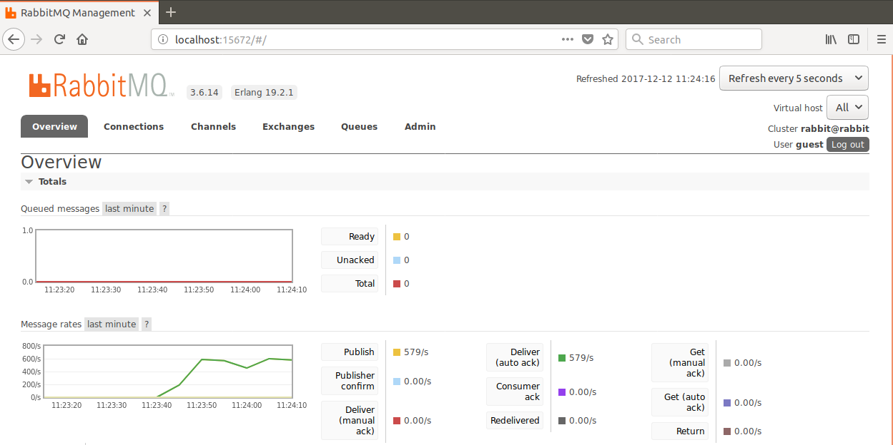

# FuzzM Installation Instructions

The following instructions assume that you can connect to the internet,
that you have or are able to install docker on your local machine,
and that you have the privileges required to execute docker containers.

## Installing Docker

Install Docker using the directions for your host platform from [here](https://www.docker.com/community-edition#/download)

To ensure Docker is installed correctly perform the following steps:
1.	Open a command prompt
2.	Type: `docker run hello-world`
3.	The words `Hello from Docker!` should appear on the screen

## Installing Docker Compose

Install Docker Compose using the directions for your host platform from [here](https://docs.docker.com/compose/install/#install-compose)

To ensure Docker Compose is installed correctly perform the following steps:

1.	Open a command prompt
2.	Type: `docker-compose –version`
3.	The version information for Docker Compose should appear on the screen

## Setting Proxy Configuration for Docker

By default, the Docker Compose file will read environment variables for proxy configuration. 
To execute docker commands behind a proxy, set the following environment variables:

```bash
PROXY_PORT=<port number> (e.g. 9090)
PROXY_HOST=<host> (e.g. proxy.company.com)
HTTP_PROXY=<proxy address> (e.g. http://proxy.company.com:9090)
```

## Launching FuzzM

To test your FuzzM installation, go to the `FuzzM/examples/fsm-model` directory and type:

`docker-compose up`

To verify the operation of the fuzzer, connect a web browser to
`http://<docker host>:15672`.  If docker is running on your local
machine, this would be `http://localhost:15672`

You will need to log in to the AMQP server as user `guest` with
password `guest`.  After logging in the web page should show activity
in the AMQP queues that reflects fuzzing activity, as in the green bar
on the graph in the image below.



To terminate the fuzzing session, type:

`docker-compose down`

## Manual Build and Execution

Stand-alone versions of FuzzM can be built manually using Docker.

### Docker Build

From the `FuzzM/fuzzm` directory:

`docker-compose down`

`docker rmi -f fuzzm`

`docker-compose up`

`docker-compose down`

The resulting jar file is stored in `FuzzM/fuzzm/fuzzm/bin/fuzzm.jar`.  

### Manual Invocation

To invoke this file using java:

`java -jar FuzzM/fuzzm/fuzzm/bin/fuzzm.jar -fuzzm [OPTIONS] /path/to/file.lus`

A UNIX shell script is also available here:

`FuzzM/fuzzm/scripts/fuzzm [OPTIONS] /path/to/file.lus`

See the [User's Guide](USING.md) for information on FuzzM's command-line arguments.

